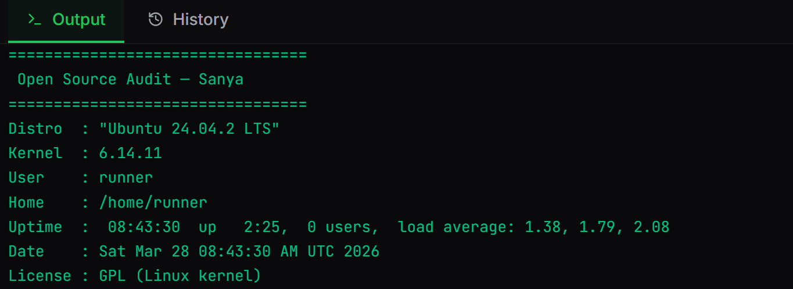
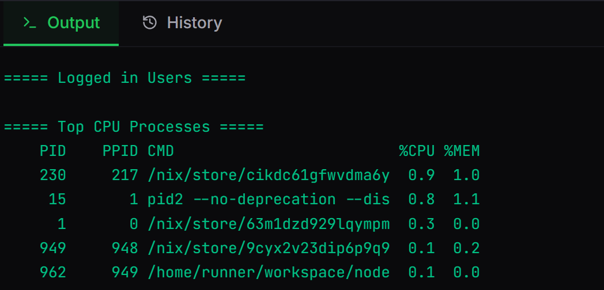
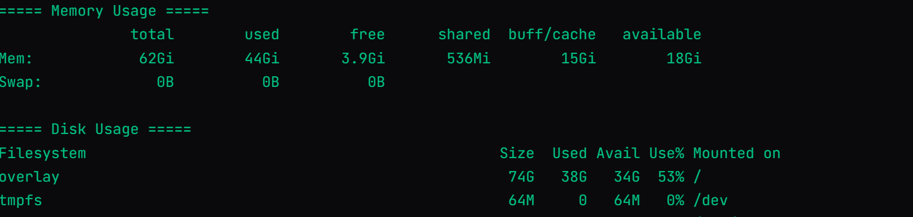
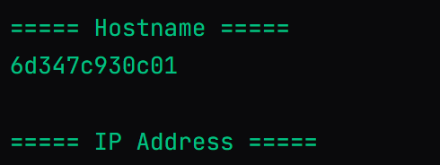

#Vityarthi-open-source-software-
Name: Sanya Bakshi 
Registration number: 24BCE10129 

Chosen Software: Git

Description:-
Git is a free and open source distributed version control system designed in 2005 by Linus Torvalds when Linx kernel needed a fast, reliable, and open alternative to proprietary version control tools
to handle everything from small to very large projects .
It is very fast and has a large ecosystem of GUIs, hosting services and command tools.

A local clone of the project is a complete version control repository. These fully functional locak repositories make it easy to work remoely or even offline.
Developers commit their workk locally, then sync their repository's copy with the server one. 
Nearly every development environment has Git support and Git command line tools implemented on every operating system.

Basic Workflow of Git:
It works by tracing changes in files and saving them as versions known as commits. 
1. Initialize a repository- Create a Git repository inside your project folder.
2. Add files to staging area.
3. Commit changes- It saves the current state of staged files.
4. Connect to repository- To upload the project online, you link it to a repository on GitHub.
5. Push code-To upload the commits to the remote repository we push it , This makes the project visible online and available for collaboration.
6. Pull updates- If someone else makes a change in the project and we agree with it, we can pull it and it will download them.

Simple lifecycle:
Create files -> Git add -> Git commit -> Git push 

Scripts:-

Script 1 – System Identity Report 
Displays kernel version, users which are logged-in, uptime and date means the information about the Linux system. It also explains the variables use, commands substitution and output.

Script 2 – FOSS Package Inspector
Checks the proper installation of Git on the system, displays information of its version and license. It uses package manager commands and conditional statements.
.

Script 3 – Disk and Permission Auditor
Shows disk usage, important directories of system and ownership and permisson of key Linux directories. 
.

Script 4 – Log File Analyzer
It reads a log filr and count the keywords appreared in it. It uses loops, text processing and also command-line arguments.
.

Script 5 – The Open source Manifesto Generator
This script generates personalized open source statement saved to a text file and also asks the user questions.

To run the scripts:-
1. Open terminal in Linux.
2. Make scripts executable by using ".sh".
3. Run the scripts ./(name of script).sh
